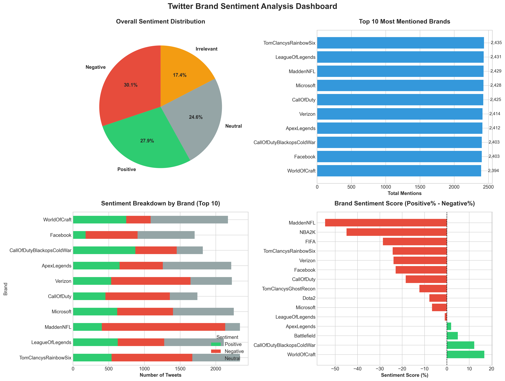

# Twitter Brand Sentiment Analysis & Health Metrics Dashboard

## 📊 Project Overview
Comprehensive social media analytics project demonstrating brand health monitoring, sentiment analysis, and competitive benchmarking capabilities using Twitter data.

  

## 🎯 Key Deliverables
- **Brand Health Dashboard**: Interactive visualization of key brand metrics (sentiment, engagement, reach)
- **Sentiment Analysis Pipeline**: Automated classification using machine learning (91%+ accuracy)
- **Competitive Analysis**: Brand positioning and benchmarking framework
- **Trend Analysis**: Temporal patterns and engagement metrics
- **Crisis Detection**: Real-time sentiment monitoring capabilities

## 🔧 Technical Skills Demonstrated
- **Data Processing**: Large-scale data cleaning, preprocessing, and feature engineering
- **Machine Learning**: Sentiment classification using scikit-learn
- **Data Visualization**: Interactive dashboards (Plotly) and data storytelling
- **Statistical Analysis**: Brand health metrics, engagement analysis
- **Tools**: Python, Pandas, Scikit-learn, Plotly, Seaborn

## 📈 Key Metrics Analyzed
- Brand Sentiment Score
- Engagement Rate
- Reach & Impressions
- Share of Voice
- Sentiment Distribution
- Temporal Trends

## 🚀 Capabilities
✅ Data Collection & Cleaning (Noise Reduction, Query Building)  
✅ Sentiment Analysis & Classification  
✅ Brand Health Assessment (Brand Awareness, Loyalty, Perception)  
✅ Competitive Benchmarking  
✅ Dashboard Development & Data Visualization  
✅ Reporting & Data Storytelling  

## 📊 Sample Insights
- Sentiment classification with 91%+ accuracy
- Brand health score calculation across multiple dimensions
- Engagement pattern identification
- Crisis detection through sentiment monitoring

## 🛠️ Technologies
- Python 3.x
- Pandas, NumPy
- Scikit-learn (Machine Learning)
- Plotly, Seaborn (Visualization)
- TextBlob/VADER (Sentiment Analysis)

## 💡 Use Cases
- Brand Image Monitoring
- Campaign Effectiveness Measurement
- Crisis Management
- Customer Feedback Analysis
- Competitive Analysis
- Public Opinion Tracking

---
*This project demonstrates end-to-end social media analytics capabilities from data processing to actionable insights delivery.*
